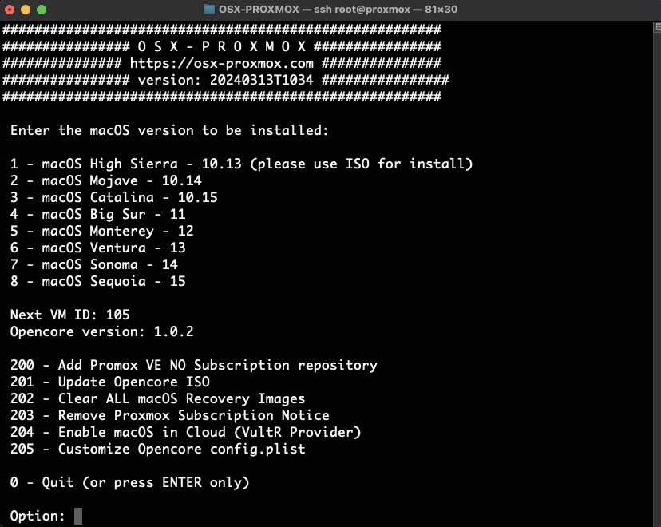

# OSX-PROXMOX - Run macOS on ANY Computer - AMD & Intel

Install `** FRESH/CLEAN **` Proxmox VE v7.0.XX ~ 8.2.XX - Next, Next & Finish (NNF).

Open Proxmox Web Console -> Datacenter > NAME OF YOUR HOST > Shell.

Copy, paste and execute (code below).

Voilà, install macOS! This is really and magic **easiest way**!

## COPY & PASTE - in shell of Proxmox (for Install or Update this solution)

```
/bin/bash -c "$(curl -fsSL https://install.osx-proxmox.com)"
```

## For install EFI Package in macOS, first disable Gatekeeper

```
sudo spctl --master-disable
```

## Versions of macOS Supported
* macOS High Sierra - 10.13
* macOS Mojave - 10.14
* macOS Catalina - 10.15
* macOS Big Sur - 11
* macOS Monterey - 12
* macOS Ventura - 13
* macOS Sonoma - 14
* macOS Sequoia - 15

## Versions of Proxmox VE Supported
* v7.0.XX ~ 8.2.XX

## Opencore version
* Oct/2024 - 1.0.2 Added support to macOS Sequoia

## Cloud Support (Yes, install your Hackintosh in Cloud Environment)
- [VultR](https://www.vultr.com/?ref=9035565-8H)
- [Vídeo/Tutorial](https://youtu.be/8QsMyL-PNrM), please activate captions!

## Disclaimer

- FOR DEV/STUDENT/TEST ONLY PURPOSES.
- I'm not responsible for any problem and/or equipment damage or loss of files. 
- Always back up everything before any changes to your computer.

## Requirements

Since Monterey, your host must have a working TSC (timestamp counter), because otherwise if you give the VM more than one core, macOS will observe the skew between cores and **kernel/memory panic** when it sees time ticking backwards. To check this, on Proxmox run:

```
dmesg | grep -i -e tsc -e clocksource
...
# for working host must be:
...
clocksource: Switched to clocksource tsc
...

# for broken host could be:
tsc: Marking TSC unstable due to check_tsc_sync_source failed
clocksource: Switched to clocksource hpet
```
Below is a possible workaround from here: https://www.nicksherlock.com/2022/10/installing-macos-13-ventura-on-proxmox/comment-page-1/#comment-55532

1. Try to turn off “ErP mode” or any C state power saving modes your BIOS supports and poweroff/poweron device (including physical cable). It could help host OS to init TSC correctly, but no guarantee.
2. Or try to activate TSC force in GRUB by adding boot flags `clocksource=tsc tsc=reliable` in the `GRUB_CMDLINE_LINUX_DEFAULT` and call `update-grub`. In this case host OS probably could work unstable in some cases.
3. Check the current TSC by call `cat /sys/devices/system/clocksource/clocksource0/current_clocksource` must be `tsc`.

## Troubleshooting

### High Siearra and below installation issues

To solve error *The Recovery Server Could Not Be Contacted* you need to change the protocol from `https://` to `http://`. To do this, follow:
- start installation and get error *The Recovery Server Could Not Be Contacted*, hold the window with error opened
- open Window -> Installer Log
- search for the line "Failed to load catalog" -> select line in log windows -> Edit -Copy
- close the error message and return to `macOS Utilities` window
- open Utilities -> Terminal, right click -> paste
- edit the pasted data, remove everything except URL, like `https://blablabla.sucatalog`
- change https -> http
- adjust the command to be like: nvram IASUCatalogURL="<your HTTP URL here>"
- press enter, quit Terminal and try to start installation again

After this, no additional ISO needed, HighSierra must be installed well from recovey.

Here a sample how need to change the error message to the final URL:

`nIUvram IASUCatalogURL="http://swscan.apple.com/content/catalogs/others/index-10.13-10.12-10.11-10.10-10.9-mountainlion-lion-snowleopard-leopard.merged-1.sucatalog"`

The solution took from here: https://mrmacintosh.com/how-to-fix-the-recovery-server-could-not-be-contacted-error-high-sierra-recovery-is-still-online-but-broken/


## Demonstration (in Portuguese/Brazil)

https://youtu.be/dil6iRWiun0

\* Please use CC with Auto Translate to English for your convenience.

## Credits

- Opencore/Acidanthera Team
- Corpnewt for Applications (ProperTree, genSMBIOS, etc)
- Apple for macOS
- Proxmox - Excelent and better documentation for Virtualization

## Discord - Universo Hackintosh
- [Discord](https://discord.universohackintosh.com.br)
